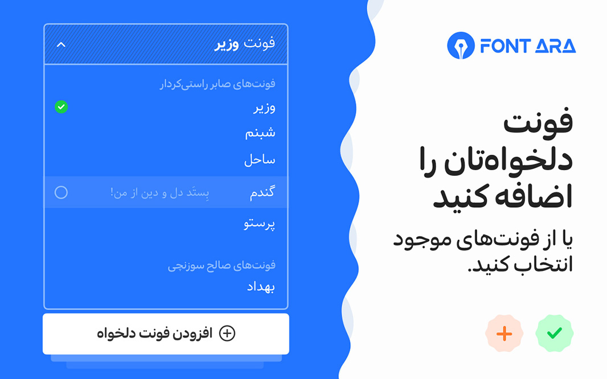
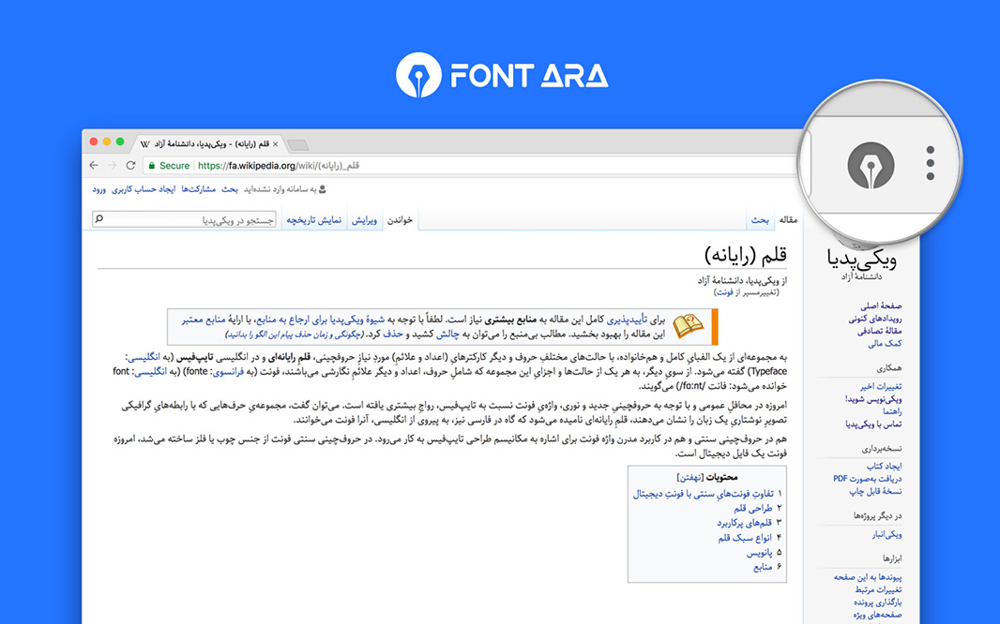
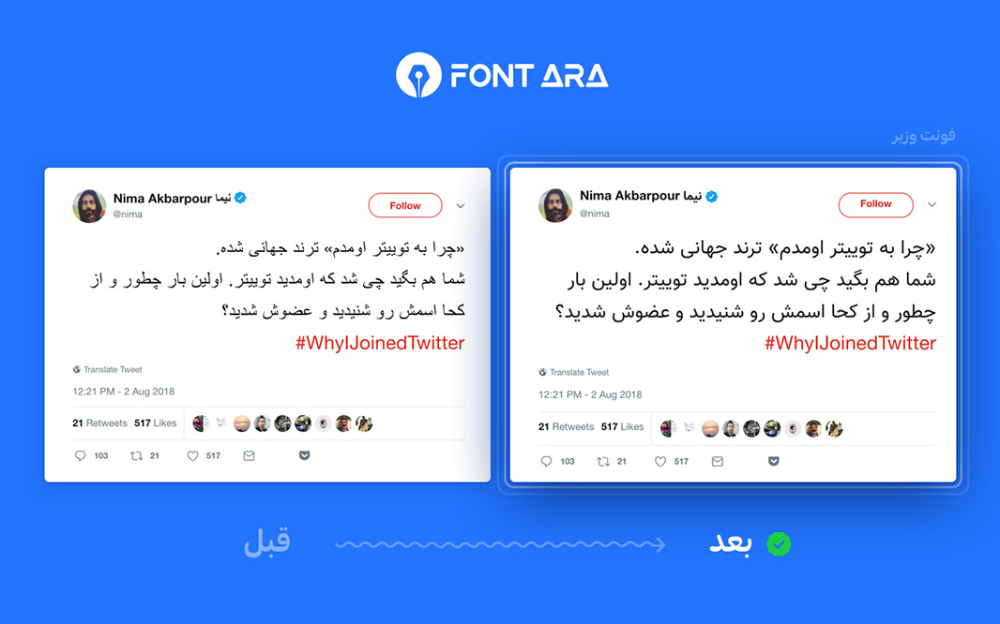
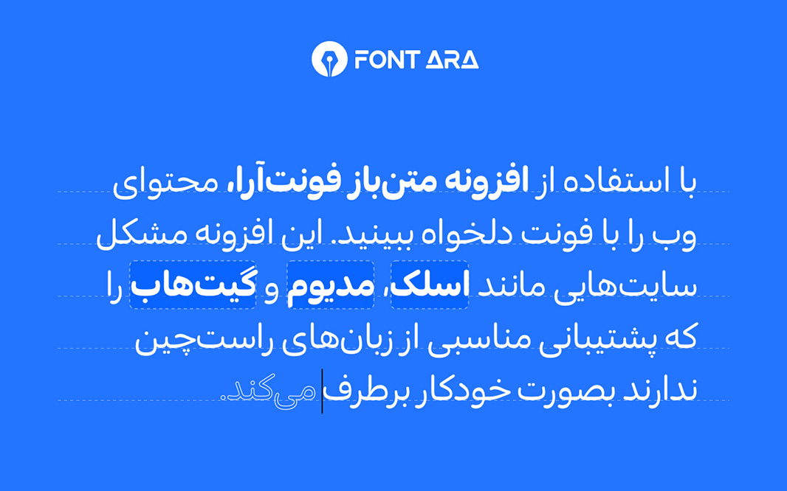

# FontARA

<p align="center">
  
</p>

[](https://github.com/mimalef70/fontara/actions/workflows/ci.yml)
[](https://github.com/mimalef70/fontara/actions/workflows/browser-tests.yml)
[](LICENSE)
[](https://chrome.google.com/webstore/detail/dcjdhicepiklefpimapdkbaeoocniemc/)
[](https://addons.mozilla.org/en-US/firefox/addon/fontara-font-changer/)
[](https://chrome.google.com/webstore/detail/dcjdhicepiklefpimapdkbaeoocniemc/)
[](https://addons.mozilla.org/en-US/firefox/addon/fontara-font-changer/)

FontARA is a cross-browser WebExtension for applying your preferred fonts across
the web. It supports multilingual pages through built-in, Google, custom, and
Chromium system fonts, with special support for RTL-first workflows: smart RTL
text detection, editable-field auto-direction, and curated per-site RTL handling.
Version 5.0.0 adds a multilingual extension UI, per-site profiles, richer font
sources, compact popup defaults, and broader release tooling across MV3 targets.


## Contents

- [Install](#install)
- [What Changes After Install](#what-changes-after-install)
- [User Features](#user-features)
- [Preview](#preview)
- [Built-in Site Optimizations](#built-in-site-optimizations)
- [Browser Support](#browser-support)
- [Development Quick Start](#development-quick-start)
- [Architecture at a Glance](#architecture-at-a-glance)
- [Privacy and Permissions](#privacy-and-permissions)
- [Troubleshooting](#troubleshooting)
- [Known Limitations](#known-limitations)
- [Quality](#quality)
- [Roadmap](#roadmap)
- [Documentation](#documentation)
- [Changelog](#changelog)
- [Contributing](#contributing)
- [Contributors](#contributors)
- [Sponsors](#sponsors)

## Install

Most users should install FontARA from the browser store. Local release builds
are mainly for testers, reviewers, and contributors.

| Browser | Store | Local release build | Browser automation |
| --- | --- | --- | --- |
| Chrome | [Chrome Web Store](https://chrome.google.com/webstore/detail/dcjdhicepiklefpimapdkbaeoocniemc/) | `pnpm build:chrome` | Stable and beta |
| Firefox | [Firefox Add-ons](https://addons.mozilla.org/en-US/firefox/addon/fontara-font-changer/) | `pnpm build:firefox` | Latest, beta, and ESR |
| Opera | [Opera Add-ons](https://addons.opera.com/en/extensions/details/fontara-font-changer/) | `pnpm build:opera` | Manual smoke |
| Edge | Build locally | `pnpm build:edge` | Chromium-compatible package |
| Brave | Build locally | `pnpm build:brave` | Chromium-compatible package |
| Safari-style MV3 package | Build locally | `pnpm build:safari` | Package output only |

<p align="center">
  <a href="https://chrome.google.com/webstore/detail/dcjdhicepiklefpimapdkbaeoocniemc/" rel="noreferrer noopener">
    
  </a>
  <a href="https://addons.mozilla.org/en-US/firefox/addon/fontara-font-changer/" rel="noreferrer noopener">
    
  </a>
  <a href="https://addons.opera.com/en/extensions/details/fontara-font-changer/" rel="noreferrer noopener">
    
  </a>
  
  
</p>

## What Changes After Install

| Before FontARA | After FontARA |
| --- | --- |
| Websites use their own font stacks, which can vary heavily between apps and operating systems. | A selected built-in, system, Google, or custom font can be applied globally, per site, or through a site profile. |
| RTL text in mixed-language editors can inherit awkward direction and alignment from the page. | Smart RTL can detect RTL scripts, adjust editable fields, and apply curated RTL adapters on supported apps. |
| Some websites need one-off CSS fixes to avoid changing icons, code, or generated UI glyphs. | Bundled site CSS targets readable text while protecting icon fonts, code blocks, SVGs, and inline font targets. |
| Browser extension settings can become hard to move between machines. | Backup, import, export, reset, and sync-friendly settings keep the setup portable. |

## User Features

- Font replacement across the web through built-in, Google, custom, and
  Chromium system font sources.
- Works on normal websites the user enables, with built-in optimized support for
  AI tools, search, social, productivity, and publishing sites such as ChatGPT,
  Claude, Gemini, Copilot, Perplexity, Google, YouTube, Gmail, X, LinkedIn,
  Instagram, Facebook, GitHub, Telegram, Slack, TickTick, Trello, Wikipedia,
  DuckDuckGo, Medium, Goodreads, Dropbox, and more.
- Per-site font and text-stroke profiles.
- Smart RTL support for right-to-left scripts, editable text surfaces, and
  curated site adapters.
- Multilingual extension UI for English, Persian, and Arabic.
- Custom font uploads with local-only storage.
- Backup, import, export, reset, sync settings, and cross-browser MV3 builds for
  Chrome, Firefox, Edge, Brave, Opera, and Safari-style packages.

## Developer Features

- Pure WebExtension build pipeline with browser-specific MV3 targets.
- Centralized site configuration for activation, CSS fixes, profiles, and RTL.
- Unit, inject, and real-browser extension tests.
- Manual and nightly browser matrix for Chrome stable/beta and Firefox
  latest/beta/ESR.
- Firefox review packaging and extension lint support.

## Preview

The screenshots below show the popup, options page, site controls, and browser
integration.










## Built-in Site Optimizations

FontARA is not limited to the sites below. The extension can apply your selected
font on normal web pages you enable through global mode, include/exclude rules,
the popup current-site toggle, or per-site profiles. Browser-internal pages and
other restricted pages are covered under [Known Limitations](#known-limitations).

The curated list below is FontARA's built-in optimized support. It currently
ships with 31 site entries, 27 bundled site CSS files, and 11 smart RTL site
adapters. These sites get faster and higher-quality font application through
targeted CSS injection, careful text selectors, icon/code protection, and curated
RTL behavior where needed. With help from users and contributors, this optimized
list can keep growing. The popup default grid highlights 20 high-priority sites
from this built-in list.

| Area | Examples |
| --- | --- |
| AI tools | ChatGPT, Claude, Gemini, Copilot, Perplexity, Poe, OpenRouter, DeepSeek, Qwen, NotebookLM, AI Studio, Arena |
| Search and Google apps | Google, Gmail, YouTube, DuckDuckGo |
| Social and communities | X, LinkedIn, Instagram, Facebook, GitHub |
| Messaging and productivity | WhatsApp, Telegram, Slack, TickTick, Messages, Trello, Dropbox |
| Reading and publishing | Wikipedia, Medium, Goodreads |

General font injection works across the web. Site matching, optimized CSS fixes,
profiles, and RTL adapters for the built-in list are maintained in `src/config`
and documented in [docs/site-fixes.md](docs/site-fixes.md).

## Browser Support

| Target | Build command | Test coverage | Notes |
| --- | --- | --- | --- |
| Chrome MV3 | `pnpm build:chrome` | Local, CI, and browser workflow | Primary Chromium release target. |
| Firefox MV3 | `pnpm build:firefox` | Local and browser workflow | Includes Firefox review packaging and `web-ext lint`. |
| Edge MV3 | `pnpm build:edge` | Chromium-compatible package | Store release should still be smoke-tested manually. |
| Brave MV3 | `pnpm build:brave` | Chromium-compatible package | Uses the Chromium extension package path. |
| Opera MV3 | `pnpm build:opera` | Manual smoke | Store behavior should be checked before publishing. |
| Safari-style MV3 | `pnpm build:safari` | Package output only | Generated package structure, not a guaranteed App Store build. |

## Development Quick Start

FontARA is built as a pure WebExtension. Source manifests live in
`src/manifest*.json`, runtime code is split across `src/background`,
`src/inject`, `src/ui`, `src/config`, and `src/utils`, and the build pipeline
lives in `tasks`.

Requirements:

- Node.js 24
- pnpm 11

```sh
pnpm install
pnpm dev
```

The default development command watches and rebuilds the Chrome MV3 debug
extension at `build/chrome-mv3-dev`.

Common commands:

| Command | Purpose |
| --- | --- |
| `pnpm dev` | Watch Chrome MV3 debug build. |
| `pnpm dev:firefox` | Watch Firefox MV3 debug build. |
| `pnpm build` | Package Chrome MV3 release build. |
| `pnpm build:all` | Package all configured MV3 release targets. |
| `pnpm check` | Run lint, typecheck, unit tests, and inject tests. |
| `pnpm verify` | Run check, all release builds, and extension lint. |
| `pnpm test:browser:chrome` | Run real Chrome extension browser tests. |
| `FONTARA_FIREFOX_BROWSER_TESTS=1 pnpm test:browser:firefox` | Run real Firefox extension browser tests. |

## Architecture at a Glance

```text
Popup / Options
  -> Background runtime
  -> Storage and site manager
  -> Tab notification
  -> Content script
  -> Page styles without reload
```

For the detailed runtime map, see [docs/architecture.md](docs/architecture.md).

## Privacy and Permissions

FontARA needs broad page access because fonts are applied by a content script on
the websites that the user enables. That permission allows the extension to work
across the web; global, include, exclude, and per-site settings still decide
where FontARA actually changes the page. The extension uses storage for settings,
custom font records, site lists, backup/import data, and syncable preferences.

| Permission or capability | Why FontARA needs it | Privacy note |
| --- | --- | --- |
| `<all_urls>` content script and host access | Apply fonts and site CSS on pages where the user enables FontARA. | Activation still respects global, include, exclude, and per-site settings. |
| `storage` | Save settings, site lists, profiles, backup/import state, and syncable preferences. | Settings are stored in browser extension storage. |
| `unlimitedStorage` | Store custom font records and larger local settings safely. | Custom font files stay local and are excluded from sync storage. |
| `tabs` | Read the current tab URL for popup state, current-site toggles, and tab notifications. | FontARA does not collect browsing history. |
| `fontSettings` | List installed system fonts on Chromium-based browsers. | Firefox builds omit this permission and keep system fonts disabled. |
| `contextMenus` | Provide quick extension actions from the browser context menu. | Optional on Chromium builds and required by Firefox packaging. |
| Web accessible font assets | Let pages load bundled extension font files through injected CSS. | Only bundled font assets are exposed. |
| Google Fonts network access | Request the selected Google Font CSS and font file when Google Fonts are enabled. | No Google API key is needed at runtime; requests happen for the selected font only. |

- Custom font files and system font choices are local-only and are excluded from
  sync storage.
- Runtime font loading requests only the selected Google Font CSS when Google
  fonts are enabled.
- Site-specific CSS is bundled with the extension and mapped through the
  configuration layer.
- Extension pages use a locked-down content security policy and expose only font
  assets to web pages.

## Troubleshooting

| Problem | What to check |
| --- | --- |
| Changes do not appear on the current page. | Toggle the current site from the popup, then wait a moment. Font changes should apply without a page reload; if a site still needs reload, report it with the Site Issue template. |
| A manually typed include/exclude pattern does not match. | Prefer a plain host like `chatgpt.com`, a path like `google.com/maps`, or an explicit wildcard such as `https://*.wikipedia.org/*`. The popup current-site toggle is the safest way to capture the active site. |
| Icons or code changed unexpectedly. | Report the site. FontARA intentionally protects icon fonts, `pre`, `code`, SVGs, and inline font targets, so this usually needs a site CSS fix. |
| A Google Font is not loading. | Confirm Google Fonts are enabled and the selected family exists in the generated catalog. Runtime loading uses `fonts.googleapis.com` and `fonts.gstatic.com`. |
| A custom font disappeared after sync. | Custom font files and system font choices are local-only by design. Export a backup on the source browser and import it on the target browser. |
| Firefox behaves differently from Chrome. | Run `FONTARA_FIREFOX_BROWSER_TESTS=1 pnpm test:browser:firefox` and check [docs/testing.md](docs/testing.md). |

## Known Limitations

- Browser-restricted pages such as extension stores, internal browser pages, and
  some privileged Mozilla domains may block content scripts.
- Cross-origin iframes depend on browser extension rules and may not expose the
  same runtime state as the top frame.
- Some websites ship high-churn generated selectors. FontARA protects against
  known brittle selector patterns, but site CSS may still need updates after a
  major website redesign.
- Safari-style output is generated for package compatibility work, but it is not
  the same as a finished Safari App Store submission.
- Google Fonts require network access to Google font endpoints when that source
  is selected. Bundled, system, and custom fonts do not need Google Fonts
  requests.

## Quality

- Main CI runs lint, typecheck, unit tests, inject tests, release builds, and
  extension lint.
- Browser automation covers popup flows, options flows, current-site
  include/exclude, backup/import/reset, storage stress, Shadow DOM, iframes,
  SPA updates, lazy DOM, virtualized lists, and viewport rendering.
- A separate manual/nightly browser workflow runs Chrome and Firefox channel
  coverage.

## Roadmap

- Generate built-in site optimization documentation directly from `src/config`.
- Expand real-browser coverage for more Chromium channels and Firefox ESR
  release gates.
- Add more curated RTL adapters and per-site profile presets.
- Improve store-release automation and screenshot freshness checks for the
  website and browser-store listings.
- Keep site CSS hygiene tests strict as new websites are added.

## Documentation

- [Development setup](docs/development.md)
- [Architecture](docs/architecture.md)
- [Site fixes and configuration](docs/site-fixes.md)
- [Testing](docs/testing.md)
- [Release process](docs/release.md)
- [Test layers](tests/README.md)
- [Static website](docs/index.html)

## Changelog

See [CHANGELOG.md](CHANGELOG.md) for release notes, migration notes, and known
release issues.

## Contributing

Contributions are welcome. Start with [CONTRIBUTING.md](CONTRIBUTING.md) before
opening a pull request, especially for site fixes, browser behavior changes, and
new settings.

If a website renders incorrectly, use the Site Issue template and include the
exact URL, browser version, selected font, and whether the page only updates
after reload.

Please also read the [Code of Conduct](CODE_OF_CONDUCT.md) and
[Security Policy](SECURITY.md).

## Contributors

<h3 align="center">Thank you to everyone who has contributed to FontARA. FontARA exists because of you.</h3>

<p align="center">
  <a href="https://github.com/mimalef70/fontara/graphs/contributors" rel="noreferrer noopener">
    
  </a>
</p>

## Sponsors

<p align="center">
  <a href="https://mu.chat" rel="noreferrer noopener">
    
  </a>
</p>

<p align="center">
  FontARA development is sponsored by <a href="https://mu.chat">Mu.chat</a>, a platform for building AI support and sales chatbots.
</p>

If your company uses FontARA or wants to support better typography on the web,
sponsorship helps maintain browser compatibility, site fixes, testing, and
release work.

## Google Fonts Catalog

The extension ships a generated Google Fonts catalog, so normal builds do not
need a Google API key. To refresh that catalog from Google Fonts Developer API
v1, provide the key through your shell, a CI secret, or a local gitignored
`.env.local` file:

```sh
GOOGLE_FONTS_API_KEY="your-key" pnpm generate:google-fonts
```

For local development, copy `.env.example` to `.env.local` and fill the key.
Never commit a real Google API key. Runtime font loading uses the public CSS2
endpoint for the selected font only.

## Acknowledgments

Thank you to Saber Rastikerdar, Saleh Suzanchi, and Amin Abedi for permission
to use their fonts in this extension. Thank you also to everyone who has tested,
reported issues, contributed fixes, or supported the project.

## License

FontARA is released under the [MIT License](LICENSE).

## Links

- [FontARA on GitHub](https://github.com/mimalef70/fontara)
- [Project website](https://mimalef70.github.io/fontara/)
- [Sponsor: Mu.chat](https://mu.chat)
- [Mostafa Alahyari on LinkedIn](https://www.linkedin.com/in/mostafaalahyari)
- [Mostafa Alahyari on X](https://x.com/mimalef70)
