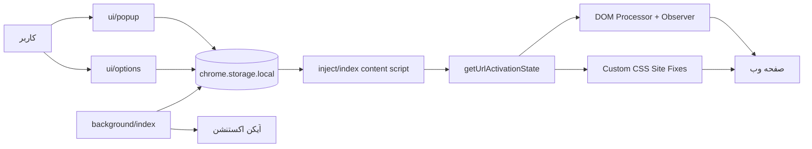
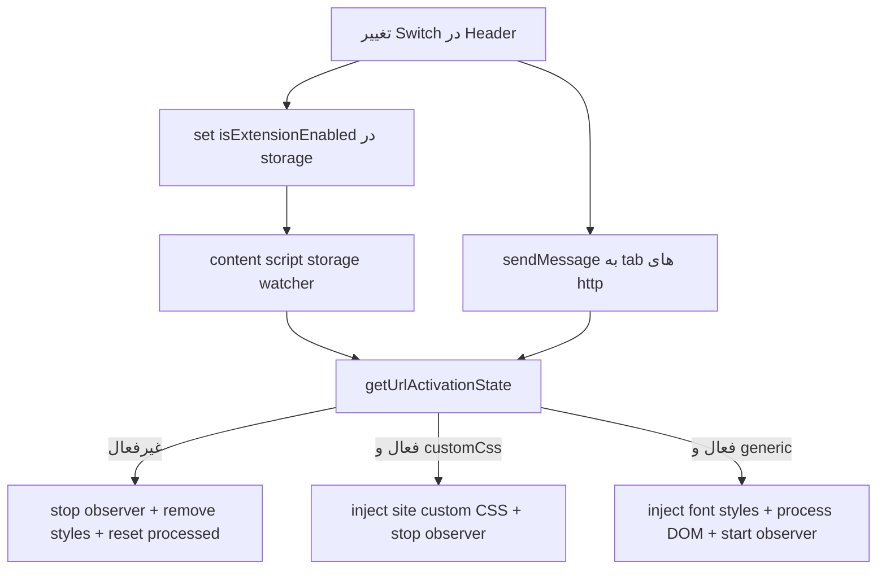
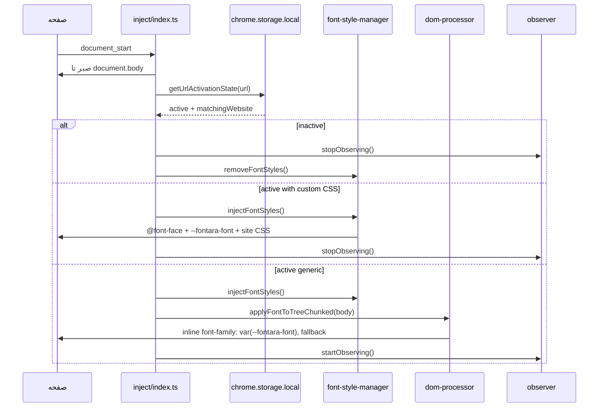
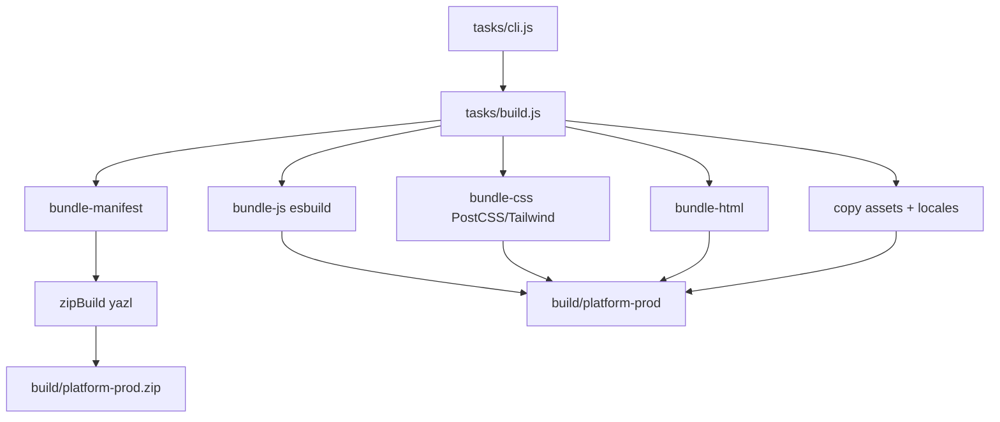

# گزارش تاریخی بررسی پروژه FontARA V4

تاریخ بررسی: 2026-06-05

> این سند یک snapshot تاریخی از وضعیت پروژه پیش از آماده‌سازی نسخه 5.0.0 است.
> برای وضعیت فعلی release، امکانات نسخه جدید، و مسیرهای build/test به
> `README.md`، `CHANGELOG.md`، `docs/release.md` و `docs/testing.md` رجوع کنید.

مسیر پروژه: `/Users/mimalef70/Local Sites/fontaraV4`

## خلاصه مدیریتی

FontARA V4 یک افزونه مرورگر Manifest V3 است که فونت متن سایت های منتخب یا سایت های سفارشی کاربر را به فونت فارسی/RTL انتخابی تغییر می دهد. پروژه وب سایت معمولی نیست، بلکه یک WebExtension با سه بخش اصلی است: background، content script تزریق شونده، و UI پاپ آپ/تنظیمات.

نتیجه سلامت فعلی:

| مورد | وضعیت |
|---|---|
| TypeScript typecheck | پاس شد |
| Build Chrome | پاس شد |
| Build all targets | پاس شد |
| Firefox web-ext lint | 0 خطا، 4 هشدار |
| Unit tests | پاس شد |
| Biome lint | پاس شد |
| Git worktree | دارای تغییرات آماده‌سازی نسخه 4.3.0 و assetهای جدید |

جمع بندی ریسک: پروژه از نظر معماری اصلی بالغ است و برای extension runtime طراحی های خوبی دارد، مثل پردازش chunked DOM، MutationObserver coalescing، و sanitization برای CSS/font data. وضعیت CI محلی در نسخه 4.3.0 سبز است. ریسک های باقی مانده بیشتر به permission های گسترده، هشدارهای Firefox برای `innerHTML` در bundle، و نگهداری فونت سفارشی به صورت base64 در storage مربوط هستند.

## پروژه چیست؟

FontARA یک افزونه تغییر فونت است. کاربر از پاپ آپ افزونه:

1. کل افزونه را روشن/خاموش می کند.
2. فونت انتخابی را عوض می کند.
3. سایت های محبوب را فعال/غیرفعال می کند.
4. برای سایت فعلی، اگر در لیست محبوب ها نیست، یک rule سفارشی اضافه می کند.
5. در صفحه options فونت دلخواه آپلود و مدیریت می کند.

افزونه در همه URL ها تزریق می شود، ولی فقط وقتی فعال می شود که:

```text
isExtensionEnabled !== false
AND
currentUrl با یکی از websiteList ها match شود
AND
matchingWebsite.isActive === true
```

## ساختار کلان



## پوشه ها و نقش ها

| مسیر | نقش |
|---|---|
| `src/manifest*.json` | manifest پایه و patch مرورگرها |
| `src/background` | service worker/background script، init storage، آیکن، install/update |
| `src/inject` | قلب افزونه: تشخیص فعال بودن URL، تزریق font-face، پردازش DOM |
| `src/ui/popup` | UI اصلی popup افزونه |
| `src/ui/options` | مدیریت فونت های سفارشی |
| `src/config` | فونت ها، سایت ها، storage keys، selector ها، CSS اختصاصی سایت ها |
| `src/utils` | helper های storage، URL، font validation، asset URL |
| `src/generators` | تولید CSS `@font-face` برای فونت های داخلی و سفارشی |
| `assets/fonts` | 25 فایل فونت bundled |
| `assets/styles` | CSS اختصاصی سایت های popular، مخصوصا ابزارهای AI، شبکه های اجتماعی و سرویس های گوگل |
| `tasks` | build pipeline دستی با esbuild/PostCSS/yazl |
| `tests/unit` | تست های واحد runtime، storage، manifest، custom font، سایت ها و UI |
| `docs` | سایت/لندینگ استاتیک پروژه، در build افزونه استفاده نمی شود |
| `site font json` | داده های کمکی/تحلیلی برای فونت سایت ها، در build استفاده نمی شود |

## Manifest و Permission ها

manifest اصلی در `src/manifest.json`:

| بخش | مقدار | تحلیل |
|---|---|---|
| `manifest_version` | 3 | MV3 |
| `content_scripts.matches` | `<all_urls>` | روی همه URL ها inject می شود |
| `run_at` | `document_start` | خیلی زود اجرا می شود تا تغییر فونت سریع باشد |
| `all_frames` | true | داخل iframe ها هم اجرا می شود |
| `match_about_blank` | true | iframe های about:blank را هم هدف می گیرد |
| `host_permissions` | `<all_urls>` | وسیع ترین سطح دسترسی |
| `permissions` | storage, unlimitedStorage, tabs | storage برای تنظیمات، tabs برای URL/آیکن/پیام، unlimitedStorage برای فونت سفارشی |
| CSP | `default-src 'none'`, `connect-src 'none'` | خوب و محدود، ولی `style-src 'unsafe-inline'` برای style injection لازم شده |

Firefox patch در `src/manifest-firefox-mv3.json` background را از service worker به scripts تبدیل می کند و `data_collection_permissions.required = none` دارد. Chrome/Edge/Brave/Opera/Safari عملا patch کرومیوم را می گیرند. خروجی Safari فقط zip MV3 است، نه تبدیل کامل Safari App Extension.

## مدل Storage

| کلید | مقدار پیش فرض | کارکرد |
|---|---|---|
| `isExtensionEnabled` | `true` | روشن/خاموش کل افزونه |
| `selectedFont` | `Vazirmatn-Fontara` | فونت انتخابی |
| `websiteList` | همه popular sites با `isActive: true` | وضعیت هر سایت و rule های سفارشی |
| `customFontList` | `[]` | فونت های سفارشی کاربر به صورت data URL |

background در `ensureStorageValues` این مقدارها را می سازد یا normalize می کند. لیست سایت های default با user storage merge می شود؛ اگر سایت default `version` داشته باشد و version عوض شده باشد، تعریف default جایگزین می شود ولی `isActive` کاربر حفظ می شود.

## روشن/خاموش بودن سایت و افزونه



کنترل های کاربر:

| کنترل | فایل | رفتار |
|---|---|---|
| Switch اصلی | `src/ui/components/layout/Header.tsx` | کل افزونه را در همه تب ها روشن/خاموش می کند |
| آیکن های سایت محبوب | `src/ui/components/PopularSection.tsx` | `isActive` سایت محبوب را toggle می کند |
| Toggle سایت فعلی | `src/ui/components/CustomUrlToggle.tsx` | برای host فعلی rule سفارشی می سازد یا `isActive` آن را تغییر می دهد |
| Font selector | `src/ui/components/FontSelector.tsx` | `selectedFont` را تغییر می دهد |
| Options page | `src/ui/options/index.tsx` | فونت سفارشی اضافه/حذف می کند |

نکته مهم: اگر URL هیچ rule فعالی نداشته باشد، افزونه روی آن سایت اعمال نمی شود. ادعای "almost any site" در README در عمل یعنی کاربر می تواند برای سایت های دیگر rule سفارشی بسازد، نه اینکه همه سایت ها به صورت پیش فرض فعال باشند.

## سایت های پیش فرض

30 سایت popular در `src/config/sites.ts` تعریف شده اند. همه در default فعال هستند. 26 سایت مسیر custom CSS دارند و برای release فعلی version rule آنها 4.3.0 است:

| سایت | custom CSS | نسخه rule |
|---|---|---|
| ChatGPT, Claude, Gemini, Copilot, Perplexity, Poe, OpenRouter, DeepSeek, Qwen, NotebookLM, AI Studio, Arena | بله | 4.3.0 |
| Google, YouTube, Gmail, GitHub, X, LinkedIn, Instagram, Facebook | بله | 4.3.0 |
| WhatsApp, Telegram, Slack, Trello, Wikipedia, DuckDuckGo | بله | 4.3.0 |
| Messages, Medium, Goodreads, Dropbox | خیر | بدون نسخه rule اختصاصی |

برای این سایت ها اگر `CUSTOM_CSS_BY_SITE[website.url]` موجود باشد، افزونه اسکن DOM را متوقف می کند و فقط style اختصاصی را inject می کند. این مسیر برای سایت های SPA سنگین طراحی شده تا هزینه پردازش DOM کم شود.

## الگوریتم اصلی تزریق فونت



## الگوریتم DOM Processor

فایل: `src/inject/dom-processor.ts`

مراحل:

1. برای root یک `TreeWalker` می سازد.
2. subtree های ممنوع را رد می کند: `script`, `style`, `img`, `svg`, `canvas`, و کلاس های icon font.
3. contenteditable را از پردازش inline کنار می گذارد تا تایپ/ادیت خراب نشود.
4. فقط عنصرهایی را هدف می گیرد که متن مستقیم دارند یا text control هستند: `input`, `textarea`, `select`, `option`.
5. `getComputedStyle(node).fontFamily` را می خواند و fallback را پاک سازی می کند.
6. کارها را جمع می کند، سپس write را جدا انجام می دهد تا read/write layout کمتر قاطی شود.
7. با `requestIdleCallback` یا `setTimeout(16)` chunk بندی می کند.
8. `WeakSet` برای جلوگیری از پردازش تکراری element استفاده می شود.
9. `processingGeneration` برای cancel کردن batch های قدیمی بعد از reset استفاده می شود.

مزیت: برای صفحه های بزرگ، UI کمتر قفل می شود.

ریسک: اگر یک element قبلا processed شده باشد و سایت بعدا font-family یا کلاس آن را عوض کند، `WeakSet` ممکن است مانع محاسبه fallback جدید شود تا زمانی که reset کامل رخ دهد.

## الگوریتم MutationObserver

فایل: `src/inject/observer.ts`

رفتار:

1. فقط وقتی مسیر generic فعال است observer روشن می شود.
2. mutation های childList و attribute های خاص را گوش می کند.
3. node های اضافه شده را در `Set` جمع می کند.
4. node های nested را حذف می کند و فقط top-level pending nodes را پردازش می کند.
5. flush با `requestAnimationFrame` زمان بندی می شود.
6. اگر contenteditable اضافه/حذف/تغییر کند، stylesheet مخصوص editable refresh می شود.

مزیت: سایت های SPA مثل GitHub/Gmail بدون reload هم فونت می گیرند.

## الگوریتم Contenteditable

فایل: `src/inject/editable-font-style.ts`

برای editor ها inline style نمی نویسد. به جای آن CSS rule می سازد:

1. top-level contenteditable ها را پیدا می کند.
2. selector پایدار از tag + `contenteditable` + attribute های مثل `id`, `data-testid`, `role`, `aria-label`, `name` می سازد.
3. fallback font را از خود editor یا child های `[data-text="true"]` و `p` می گیرد.
4. یک rule عمومی static و حداکثر 32 rule dynamic می سازد.
5. inline fontara style های داخل editor را پاک می کند.

مزیت: احتمال شکستن cursor، selection و typing کمتر می شود.

ریسک: اگر editor attribute پایدار نداشته باشد، فقط rule عمومی اعمال می شود. سقف 32 rule هم در صفحه های خیلی پیچیده ممکن است همه editor ها را پوشش ندهد.

## الگوریتم Custom CSS

فایل ها:

| فایل | هدف |
|---|---|
| `assets/styles/chatgpt.css` | اعمال عمومی روی ChatGPT |
| `assets/styles/gemini.css` | اعمال محدودتر روی surfaces متنی Gemini |
| `assets/styles/linkedin.css` | اعمال عمومی روی LinkedIn |
| `assets/styles/whatsapp.css` | اعمال روی body و RTL parts |
| `assets/styles/x.css` | اعمال عمومی روی X با exception برای code/pre |

اگر سایت custom CSS داشته باشد:

```text
injectFontStyles()
  -> @font-face داخلی را inject می کند
  -> --fontara-font را روی :root می گذارد
  -> اگر فونت سفارشی انتخاب شده باشد، فقط همان font-face را inject می کند
  -> inline/font editable قدیمی را پاک می کند
  -> custom CSS سایت را upsert می کند
  -> true برمی گرداند تا observer خاموش بماند
```

ریسک مهم: ChatGPT و LinkedIn در CSS فعلی `body *` دارند و exception برای monospace/code ندارند. تست ها هم دقیقا به همین ناحیه گیر داده اند.

## فونت های داخلی و سفارشی

فونت های داخلی در `src/config/fonts.ts` تعریف شده اند: Vazirmatn, Samim, Shabnam, Arad, Sahel, Parastoo, Gandom, Tanha, Nahid, Azarmehr, Mikhak, Estedad, Behdad, Nika, Ganjname, Shahab.

`src/fonts.css` برای هر فونت `@font-face` دارد و `unicode-range` را به محدوده عربی/فارسی محدود کرده است:

```text
U+0600-06FF, U+0750-077F, U+FB50-FDFF, U+FE70-FEFF
```

این یعنی فونت های FontARA عمدتا برای متن فارسی/عربی اعمال می شوند و متن لاتین معمولا fallback سایت را نگه می دارد.

فونت سفارشی:

| مرحله | رفتار |
|---|---|
| انتخاب فایل | فقط `ttf`, `woff`, `woff2`, `otf` |
| حجم | حداکثر 2MB |
| hash | SHA-256 برای جلوگیری از duplicate |
| ذخیره | data URL base64 در `customFontList` |
| value | prefix تصادفی 6 کاراکتری + `-Fontara` |
| validation runtime | MIME/data URL، pattern امن font value، extension |
| تزریق | فقط فونت سفارشی selected شده inject می شود، نه همه |

ریسک: اعتبارسنجی، magic bytes واقعی font را بررسی نمی کند و بیشتر به extension/MIME/data URL متکی است.

## Build pipeline



ورودی های JS:

| entry | خروجی |
|---|---|
| `src/background/index.ts` | `background/index.js` |
| `src/inject/index.ts` | `inject/index.js` |
| `src/ui/popup/index.tsx` | `ui/popup/index.js` |
| `src/ui/options/index.tsx` | `ui/options/index.js` |

پلتفرم ها: chrome-mv3, firefox-mv3, edge-mv3, brave-mv3, opera-mv3, safari-mv3.

نکته: `build:all` خروجی های platform را تازه می سازد، اما کل پوشه `build` را پاک نمی کند. اگر source package یا zip قدیمی از نسخه های قبل کنار خروجی 4.3.0 باقی بماند، چون `build/` ignored است ریسک اصلی آن سردرگمی محلی است نه commit.

## جدول فانکشن های مهم

### Runtime و Inject

| فایل | فانکشن | کارکرد |
|---|---|---|
| `inject/index.ts` | `mergeApplyMode` | اگر یکی از apply ها full باشد، mode نهایی full می شود |
| `inject/index.ts` | `runWhenBodyIsReady` | اجرای pipeline بعد از آماده شدن body |
| `inject/index.ts` | `applyFontsIfActive` | تصمیم اصلی: inactive، custom CSS، یا generic DOM |
| `inject/index.ts` | `runScheduledApplyFontsIfActive` | جلوگیری از اجرای همزمان apply و merge کردن queued run ها |
| `inject/index.ts` | `scheduleApplyFontsIfActive` | schedule با microtask برای coalesce |
| `inject/index.ts` | `handleRuntimeMessage` | پاسخ به پیام toggle از popup |
| `inject/index.ts` | `cleanupRuntimeListeners` | پاکسازی observer/listener/style در context invalidation/pagehide |
| `dom-processor.ts` | `createFontWorkCollection` | ساخت TreeWalker و رد کردن subtree های ممنوع |
| `dom-processor.ts` | `collectNextFontWork` | جمع آوری chunked کارهای font |
| `dom-processor.ts` | `collectFontWork` | نسخه synchronous برای تست/استفاده مستقیم |
| `dom-processor.ts` | `writeFontWork` | نوشتن inline `font-family` با `!important` |
| `dom-processor.ts` | `writeFontWorkChunked` | نوشتن batch ها با idle callback |
| `dom-processor.ts` | `resetProcessedElements` | پاک کردن WeakSet و افزایش generation |
| `dom-processor.ts` | `applyFontToTreesChunked` | پردازش چند root node جدید |
| `observer.ts` | `startObserving` | فعال کردن MutationObserver |
| `observer.ts` | `flushPendingNodes` | اعمال فونت روی node های coalesced |
| `observer.ts` | `stopObserving` | قطع observer و cancel frame |
| `font-style-manager.ts` | `injectFontStyles` | تزریق font-face، CSS variable، custom font و custom CSS |
| `font-style-manager.ts` | `removeFontStyles` | حذف همه style های FontARA |
| `font-style-manager.ts` | `updateFontVariable` | تنظیم `--fontara-font` |
| `editable-font-style.ts` | `refreshEditableFontStyles` | ساخت CSS برای contenteditable ها |
| `editable-font-style.ts` | `removeEditableFontStyles` | حذف CSS editor ها |

### Background و Storage

| فایل | فانکشن | کارکرد |
|---|---|---|
| `background/index.ts` | `logStorageError` | لاگ debug برای init storage |
| `storage-manager.ts` | `mergeWebsiteLists` | merge/migrate سایت های default با تنظیمات کاربر |
| `storage-manager.ts` | `normalizeCustomFontList` | پاکسازی/اعتبارسنجی custom font list |
| `storage-manager.ts` | `ensureStorageValues` | ساخت default storage و normalize در startup/install/update |
| `icon-manager.ts` | `updateIconStatus` | آیکن active/default بر اساس URL tab فعلی |
| `icon-manager.ts` | `registerIconListeners` | گوش دادن به تغییر tab/storage برای update icon |

### Utils و Generators

| فایل | فانکشن | کارکرد |
|---|---|---|
| `utils/url.ts` | `createRegexFromUrl` | تبدیل URL سفارشی به regex host-level |
| `utils/url.ts` | `getMatchingWebsite` | match کردن URL با regex سایت ها |
| `utils/url.ts` | `getUrlActivationState` | تعیین active و website match شده |
| `utils/storage.ts` | `getLocalValue` و خانواده | wrapper promise دار برای `chrome.storage.local` |
| `utils/storage.ts` | `watchLocalStorage` | watcher امن برای تغییرات storage |
| `utils/font-data.ts` | `getFontDataURLFormat` | تشخیص و اعتبارسنجی data URL فونت |
| `utils/font-data.ts` | `escapeCSSString` | escape برای جلوگیری از شکستن CSS string |
| `utils/custom-fonts.ts` | `createCustomFontDeletionUpdate` | حذف فونت و reset selected اگر لازم باشد |
| `generators/font-face.ts` | `getFontFaceCSS` | تبدیل URL فونت های asset به `chrome.runtime.getURL` |
| `generators/custom-font-face.ts` | `createCustomFontFaces` | تولید `@font-face` برای فونت های سفارشی معتبر |

### UI

| فایل | کامپوننت/هوک | کارکرد |
|---|---|---|
| `popup/index.tsx` | `IndexPopup` | layout پاپ آپ، header، font selector، popular sites، custom URL |
| `options/index.tsx` | `OptionsPage` | آپلود، validate، ذخیره و حذف فونت سفارشی |
| `Header.tsx` | `Header` | switch اصلی و لینک نسخه/لوگو |
| `PopularSection.tsx` | `PopularUrl` | grid سایت های محبوب و toggle active |
| `CustomUrlToggle.tsx` | `CustomUrlToggle` | rule سفارشی برای host تب فعلی |
| `FontSelector.tsx` | `FontSelector` | drawer انتخاب فونت داخلی/سفارشی با preview |
| `use-storage.ts` | `useStorageValue` | state React sync شده با chrome storage |
| `use-selected-ui-font.ts` | `useSelectedUIFont` | اعمال فونت انتخابی روی UI خود افزونه |
| `use-toast.ts` | `useToast` | سیستم toast سبک |
| `ErrorBoundary.tsx` | `ErrorBoundary` | fallback UI برای خطای render |

### Build scripts

| فایل | فانکشن | کارکرد |
|---|---|---|
| `tasks/cli.js` | `getPlatforms`, `main` | parse کردن flag ها و اجرای build/watch |
| `tasks/build.js` | `buildPlatform`, `build`, `watch` | orchestrator build و watch |
| `tasks/bundle-js.js` | `bundleJS` | esbuild برای چهار entry اصلی |
| `tasks/bundle-css.js` | `bundleCSS` | Tailwind/PostCSS و کپی fonts.css |
| `tasks/bundle-manifest.js` | `bundleManifest` | merge manifest پایه، patch مرورگر، version package |
| `tasks/copy.js` | `copyAssets` | کپی assets و locales |
| `tasks/zip.js` | `zipBuild` | ساخت zip خروجی |
| `tasks/source-package.js` | `createSourcePackage` | ساخت source zip برای Mozilla review |

## مشکلات و ریسک ها

| شدت | مورد | توضیح | پیشنهاد |
|---|---|---|---|
| متوسط | Firefox lint warning | 4 هشدار `UNSAFE_VAR_ASSIGNMENT to innerHTML` در bundle popup/options | بررسی وابستگی تولیدکننده، مستند کردن برای AMO، یا کاهش dependency اگر لازم شد |
| متوسط | permission گسترده | `<all_urls>`, `host_permissions`, `all_frames`, `tabs`, `unlimitedStorage` | اگر محصول واقعا همه سایت ها را هدف نمی گیرد، active permissions/optional hosts را بررسی کنید |
| متوسط | custom CSS های گسترده | در سایت های پرتغییر ممکن است selectorها نیازمند نگهداری دوره ای باشند | برای سایت های حساس exception های code/icon/monospace و تست کاربردی نگه دارید |
| متوسط | README می گوید unlimited custom fonts | کد محدودیت 2MB per file و محدودیت storage دارد | متن README را دقیق کنید |
| متوسط | سایت های بدون version rule | سایت های generic مثل Medium اگر بعدا regex/icon آنها عوض شود باید با migration عمومی همگام شوند | برای تغییرات آینده روی همه سایت های default version یا sync metadata عمومی را حفظ کنید |
| پایین | ذخیره base64 فونت در local storage | افزایش مصرف storage و احتمال quota/performance | تعداد/حجم کل را نشان دهید، `getBytesInUse` را در UI استفاده کنید |
| پایین | stale build artifacts | خروجی های build قدیمی ممکن است کنار خروجی جدید باقی بمانند | قبل از package source یا release، build root را پاک کنید یا script cleanup بسازید |
| پایین | Safari target واقعی نیست | zip کرومیوم برای safari-mv3 ساخته می شود | اگر Safari مدنظر است مسیر xcrun/safari-web-extension-converter لازم است |

## خروجی دستورهای اجرا شده

| دستور | نتیجه |
|---|---|
| `pnpm typecheck` | پاس |
| `pnpm test` | پاس |
| `pnpm lint` | پاس |
| `pnpm build` | پاس، chrome-mv3-prod.zip ساخته شد |
| `pnpm build:all` | پاس، همه zip های browser target ساخته شد |
| `pnpm exec web-ext lint --source-dir ./build/firefox-mv3-prod` | 0 errors, 0 notices, 4 warnings |

تست های شکننده قرارداد CSS حذف شده اند و پوشش فعلی روی رفتارهای پایدارتر مثل storage، font data، manifest، runtime و UI متمرکز است.

## نقاط قوت

| نقطه قوت | توضیح |
|---|---|
| معماری clear و جدا | background، inject، UI، config، utils جدا هستند |
| پردازش DOM بهینه تر از naive | read/write جدا، chunking، idle callback، WeakSet |
| پشتیبانی SPA | MutationObserver با coalescing |
| contenteditable فکر شده | مسیر stylesheet جدا برای editor ها |
| custom font sanitization | pattern امن، data URL validation، CSS escaping |
| CSP محدود | connect-src none و عدم remote code |
| build مستقل از Plasmo | pipeline ساده و قابل فهم |
| تست های هدفمند | storage، manifest، icon، performance، UI، workflow پوشش دارند |

## پیشنهادهای اولویت دار

1. README را با واقعیت custom font limits و فعال سازی سایت سفارشی دقیق تر کنید.
2. برای permission ها یک تصمیم محصولی بگیرید: اگر همه URL ها لازم است، در مستندات reviewer توضیح دهید؛ اگر نه، optional permissions را بررسی کنید.
3. برای options page نمایش مصرف storage و تعداد/حجم فونت ها اضافه کنید.
4. برای تغییرات آینده سایت های default، sync metadata عمومی و version ruleها را کنار هم نگه دارید تا آپدیت کاربران بدون نصب دوباره انجام شود.
5. هشدار Firefox `innerHTML` را تا منبع دقیق در bundle trace کنید و اگر ناشی از React/dependency است در source package review note توضیح دهید.

## جمع بندی

FontARA V4 از نظر ایده و معماری یک افزونه فونت چنجر جدی و نسبتا خوب مهندسی شده است. مسیرهای runtime برای حالت generic، سایت های custom CSS، فونت سفارشی، editor ها و تغییرات زنده DOM طراحی شده اند. در نسخه 4.3.0 مسیرهای test/lint/typecheck/build سبز شده اند؛ ریسک های اصلی باقی مانده بیشتر در حوزه permission، نگهداری CSS سایت های پرتغییر، storage فونت سفارشی و مستندسازی warningهای Firefox برای review هستند.
